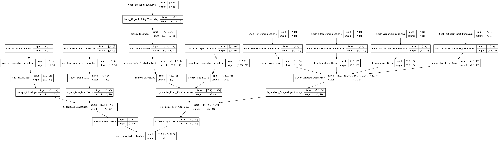
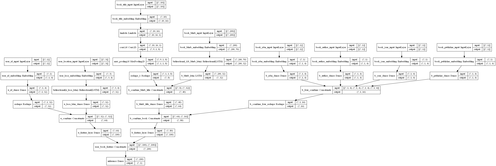

### model_0

原用户特征：
- User-ID
- Location

对用户的location数据进行数据处理换成`1*3`的数据张良进行各个特征的经过word-embedding处理-relu激活函数-GRU（Gate Recurrent Unit）循环神经网络构建模型-全连接+tanh激活函数-reshape层生成用户画像

书籍特征：
- ISBN
- Title
- Author
- Year
- Publisher
- Blurb

对书记的ISBN、author、year、publisher换成index索引处理，对数据进行去噪，讲title换成`1*15`的数据张量、blurb换成`1*200`的数据张量，对各个特征经过经过word-embedding处理-relu激活函数-GRU（Gate Recurrent Unit）循环神经网络构建模型-全连接+tanh激活函数-reshape层生成书籍的画像

问题：生成的数据过拟合甚至不拟合，解决办法尝试使用长短期记忆模型lstm办法

### model_1
原用户特征：
- User-ID
- Location

对用户的location数据进行数据处理换成`1*3`的数据张良进行各个特征的经过word-embedding处理-relu激活函数-lstm（Long short-term memory）长短期记忆模型-全连接+tanh激活函数-reshape层生成用户画像

书籍特征：
- ISBN
- Title
- Author
- Year
- Publisher
- Blurb

对书记的ISBN、author、year、publisher换成index索引处理，对数据进行去噪，讲title换成`1*15`的数据张量、blurb换成`1*200`的数据张量，对各个特征经过经过word-embedding处理-relu激活函数--lstm（Long short-term memory）长短期记忆模型-全连接+tanh激活函数-reshape层生成书籍的画像

问题：生成的数据训练效果不拟合情况缓解，但是出现过拟合现象，解决办法尝试使减少训练的数据集、word2vex、加上正则化、使用dropout等办法

### model_2
