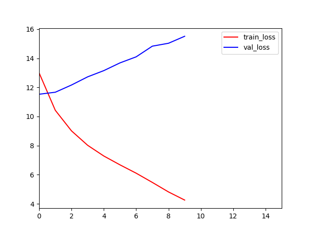

## 协同过滤
协同过滤，从字面上理解，包括协同和过滤两个操作。所谓协同就是利用群体的行为来做决策(推荐)，生物上有协同进化的说法，通过协同的作用，让群体逐步进化到更佳的状态。对于推荐系统来说，通过用户的持续协同作用，最终给用户的推荐会越来越准。而过滤，就是从可行的决策(推荐)方案(标的物)中将用户喜欢的方案(标的物)找(过滤)出来。

具体来说，协同过滤的思路是通过群体的行为来找到某种相似性(用户之间的相似性或者标的物之间的相似性)，通过该相似性来为用户做决策和推荐。

现实生活中有很多协同过滤的案例及思想体现，除了前面提到的生物的进化是一种”协同过滤“作用外，我认为人类喜欢追求相亲中的“门当户对”，其实也是一种协同过滤思想的反射，门当户对实际上是建立了相亲男女的一种“相似度”(家庭背景、出身、生活习惯、为人处世、消费观、甚至价值观可能会相似)，给自己找一个门当户对的伴侣就是一种“过滤”，当双方”门当户对“时，各方面的习惯及价值观会更相似，未来幸福的概率也会更大。如果整个社会具备这样的传统和风气，以及在真实”案例“中”门当户对“的夫妻确实会更和谐，通过”协同进化“作用，大家会越来越认同这种方式。我个人也觉得”门当户对“是有一定道理的。

协同过滤利用了两个非常朴素的自然哲学思想：“群体的智慧”和“相似的物体具备相似的性质”，群体的智慧从数学上讲应该满足一定的统计学规律，是一种朝向平衡稳定态发展的动态过程，越相似的物体化学及物理组成越一致，当然表现的外在特性会更相似。虽然这两个思想很简单，也很容易理解，但是正因为思想很朴素，价值反而非常大。所以协同过滤算法原理很简单，但是效果很不错，而且也非常容易实现。

## 系统架构的实现
> 系统实现尽可能的自动化，自动缓存数据，缓存调度的数据/运行结果等等。设置main.py入口方便调用不同版本的模型

```
Mode                LastWriteTime         Length Name
----                -------------         ------ ----
d-----        2020/4/17     13:44                Data
d-----        2020/4/20     18:18                Models
d-----        2020/4/16     16:32                Public
d-----         2020/4/9     12:15                Source
d-----        2020/4/17     15:44                Tmp
-a----         2020/4/9     12:15            444 .gitignore
-a----        2020/4/20     11:16            834 main.py
-a----         2020/4/9     12:15          75802 model_0.ipynb
-a----         2020/4/9     12:15          46235 model_1.ipynb
-a----         2020/4/9     12:15         268579 model_2.ipynb
-a----         2020/4/9     12:15          17190 model_3_bert.py
-a----        2020/4/20     11:25           1297 README.MD
```

### Data
> 对数据进行预处理，并且自动解压数据取得数据后用pickle缓存存入倒tmp缓存文件夹

```
Mode                LastWriteTime         Length Name
----                -------------         ------ ----
d-----        2020/4/17     13:44                BX-CSV-Dump
d-----        2020/4/17     14:27                __pycache__
-a----         2020/4/9     12:15       45300478 BX-CSV-Dump.zip
-a----         2020/4/9     12:15           7793 Prepro_data.ipynb
-a----        2020/4/17     14:14          10293 Prepro_data.py
-a----        2020/4/20     14:15           2718 __init__.py
```
## Models模型的迭代升级/学习使用
> 模型设计文件存放，包括模型计算后的损失曲线、架构等等。
> 
```
Mode                LastWriteTime         Length Name
----                -------------         ------ ----
d-----         2020/4/9     12:15                Curve_loss
d-----         2020/4/9     12:15                Structure
-a----         2020/4/9     12:15           1951 Base_layers.py
-a----        2020/4/20     18:19             37 model_0.md
-a----         2020/4/9     12:15           9696 model_0.py
-a----        2020/4/16     16:38           8219 model_1.py
-a----         2020/4/9     12:15          10953 model_2.py
-a----         2020/4/9     12:15              0 model_test.py
-a----        2020/4/20     18:25           4026 README.MD
-a----         2020/4/9     12:15           2390 train_data.py
-a----         2020/4/9     12:15              0 __init__.py
```
### model_0

原用户特征：
- User-ID
- Location


对用户的location数据进行数据处理换成`1*3`的数据张良进行各个特征的经过word-embedding处理-relu激活函数-GRU（Gate Recurrent Unit）循环神经网络构建模型-全连接+tanh激活函数-reshape层生成用户画像


书籍特征：
- ISBN
- Title
- Author
- Year
- Publisher
- Blurb

对书记的ISBN、author、year、publisher换成index索引处理，对数据进行去噪，讲title换成`1*15`的数据张量、blurb换成`1*200`的数据张量，对各个特征经过经过word-embedding处理-relu激活函数-GRU（Gate Recurrent Unit）循环神经网络构建模型-全连接+tanh激活函数-reshape层生成书籍的画像

问题：生成的数据过拟合甚至不拟合，解决办法尝试添加新的特征、使用长短期记忆模型lstm、word2vex、加上正则化等办法


### model_1

### model_2